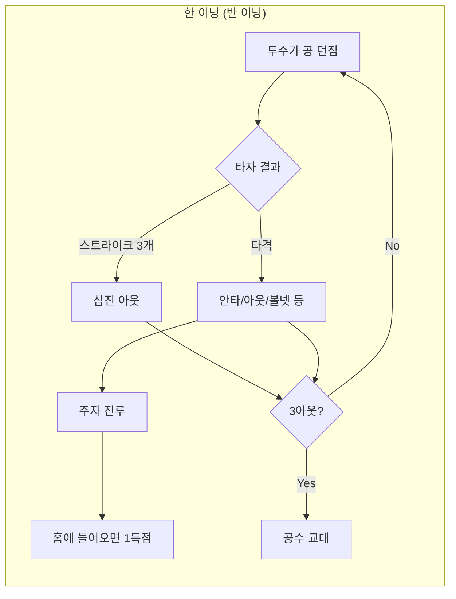
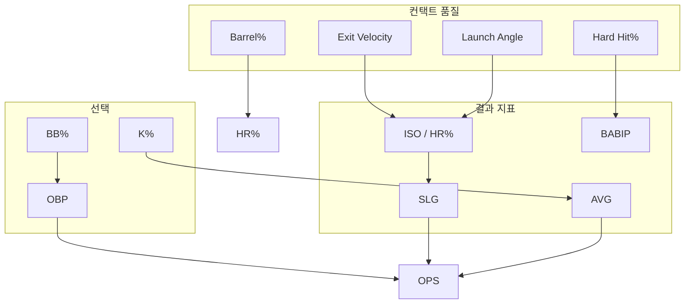

LG Aimers Real Data 과제를 앞두고 정리한 야구 규칙·용어·통계 상호작용 메모. Tabular ML과 LLM 최적화 과제에서 feature 설계·leakage 방지에 바로 쓸 수 있게 구성했다.

* * *

## 1\. 경기 구조

야구는 공격팀과 수비팀이 번갈아 치르는 9이닝 경기다. 연장전이 붙을 수 있다.



| 개념 | 설명 |
| --- | --- |
| 이닝 | 공격·수비가 각각 1회씩 끝나면 1이닝. 보통 9이닝 |
| 아웃 | 반 이닝마다 3아웃이면 공수 교대 |
| 득점 | 주자가 홈베이스를 밟으면 1점 |
| 안타 | 타격 후 아웃 없이 베이스 도달 |
| 볼넷(BB) | 4볼이면 1루 |
| 삼진(SO/K) | 스트라이크 3개 |
| 홈런(HR) | 한 번에 1~4점 |

### 1-1. 볼카운트 — 타석의 상태 머신

투수와 타자의 대결은 볼카운트(B-S)로 진행된다. pitch-by-pitch 로그가 있으면 이 상태가 그대로 컬럼이 된다.

| 판정 | 조건 | 결과 |
| --- | --- | --- |
| 스트라이크 | 스트라이크 존 통과, 헛스윙, 파울(2스트라이크까지만) | 3개면 삼진 |
| 볼 | 존 밖 + 타자가 치지 않음 | 4개면 볼넷 |
| 파울 | 타구가 페어 지역 밖으로 | 2스트라이크 이후엔 카운트 유지 (삼진 안 됨) |
| 인플레이 | 페어 지역 타구 | 안타/아웃/에러 등으로 타석 종결 |

주자 아웃 방식은 두 가지다. 포스 아웃(주자가 반드시 가야 하는 베이스를 공이 먼저 밟음)과 태그 아웃(공을 든 야수가 주자를 직접 터치). 한 타구로 2아웃을 잡으면 병살(GDP), 투구 사이에 다음 베이스를 훔치면 도루(SB), 실패하면 도루자(CS)다.

### 1-2. KBO 운영 차이 — 데이터에 직접 영향

KBO(한국 프로야구)는 MLB와 규칙이 거의 같고 DH(지명타자)를 쓴다. 데이터 작업에 직접 영향을 주는 차이는 다음과 같다.

| 항목 | KBO | 데이터 영향 |
| --- | --- | --- |
| 정규시즌 | 10개 구단 × 144경기 | 표본 크기 |
| 연장전 | 12회까지, 이후 **무승부** | 승/패/무 3-class — 승률 모델 타깃 설계에 직결 |
| 트래킹 데이터 | Statcast급 공개 데이터 없음 | EV·Barrel% 류는 못 쓸 수 있음 (§4-2) |
| 구장 | 잠실(넓음)·사직(좁음) 등 편차 큼 | park factor 필수 |

* * *

## 2\. 포지션

| 포지션 | 약어 | 역할 |
| --- | --- | --- |
| 투수 | P | 공을 던진다. 경기 흐름의 절반 가까이를 좌우 |
| 포수 | C | 배치·사인, 프레이밍 |
| 1루수 | 1B | 땅볼·송구 |
| 2루수 | 2B | 더블플레이·내야 수비 |
| 3루수 | 3B | 강한 손, 번트 대응 |
| 유격수 | SS | 수비 범위가 가장 넓음 |
| 좌/중/우 외야 | LF/CF/RF | 플라이·장타 처리 |
| 지명타자 | DH | 타격만 (KBO) |

투수·타자·수비는 feature 공간이 완전히 다르다. 한 모델에 넣을 때는 `role`이나 `position`을 반드시 넣거나, 아예 모델을 나눠야 한다.

* * *

## 3\. 타석 결과 (데이터의 원자 단위)

통계는 대부분 타석(PA, Plate Appearance)이나 타수(AB, At Bat)에서 집계된다.

| 결과 | 약어 | AB 포함 | OBP 포함 |
| --- | --- | --- | --- |
| 1루 안타 | 1B | O | O |
| 2루 안타 | 2B | O | O |
| 3루 안타 | 3B | O | O |
| 홈런 | HR | O | O |
| 볼넷 | BB | X | O |
| 몸에 맞는 공 | HBP | X | O |
| 희생플라이 | SF | X | O (분모) |
| 삼진 | K | O | O |
| 땅볼 아웃 | GO | O | O |

타율 분모는 AB만, 출루율 분모는 PA에 가깝다. 컬럼 정의를 틀리면 feature 전체가 어긋난다.

규정타석·규정이닝도 알아두면 좋다. 타율 순위 등재 기준은 규정타석(팀 경기 수 × 3.1), 투수는 규정이닝(팀 경기 수 × 1.0)이다. 데이터에서 소표본 선수를 거를 때 같은 기준을 그대로 재사용할 수 있다.

* * *

## 4\. 지표 사전

### 4-1. 타자 — 전통 지표

| 지표 | 한글 | 공식(개념) | 해석 |
| --- | --- | --- | --- |
| AVG | 타율 | 안타 / 타수 | 맞춰서 베이스에 간 비율. .300이면 상위권 |
| OBP | 출루율 | (H+BB+HBP) / (AB+BB+HBP+SF) | 득점 기회. 승리와의 상관이 타율보다 큼 |
| SLG | 장타율 | 루타 / AB | 1B=1, 2B=2, 3B=3, HR=4 |
| OPS | — | OBP + SLG | 타격 종합 지표. .800 이상이면 우수 |
| RBI | 타점 | 타격으로 들어온 득점 | 팀·타순에 크게 의존 |
| R | 득점 | 본인이 홈에 들어온 횟수 | 마찬가지로 맥락 의존 |
| SB | 도루 | — | 속도·판단 |
| K% | 삼진율 | K / PA | 올라가면 장타는 늘 수 있지만 AVG는 떨어지기 쉽다 |
| BB% | 볼넷율 | BB / PA | 올라가면 OBP 상승 |

**할푼리** = 타율의 한국식 읽기다. 할=0.1, 푼=0.01, 리=0.001 단위라서 타율 0.325를 "3할 2푼 5리"라고 읽는다. 별도 지표가 아니라 AVG 그 자체이며, 데이터에는 0.325 같은 소수로 들어오므로 변환할 일은 없다. 다만 중계·기사 텍스트를 LLM에 넣을 때 "3할 타자" = AVG ≥ 0.300, "1할대" = 부진이라는 매핑은 알아둬야 한다.

### 4-2. 타자 — 세이버메트릭

| 지표 | 의미 | ML에서 쓰는 이유 |
| --- | --- | --- |
| wOBA | 출루 종류별 가중 출루율 | OPS보다 득점 기여에 가깝게 설계됨 |
| wRC+ | 조정 득점 창출, 100=리그 평균 | 구장·리그 보정된 타자 성능 |
| WAR | 대체 선수 대비 승리 기여 (누적) | 타격·수비·주루 종합. 시즌 6+ 이면 MVP급 |
| BABIP | (H-HR)/(AB-K-HR+SF) | 운(luck)과 실력 분리 |
| ISO | SLG − AVG | 순수 장타력 |
| Barrel% | 최적 각·속도 구간 타구 비율 | Statcast 기반 타격 품질 |
| Hard Hit% | 95mph+ 타구 비율 | contact quality |
| Launch Angle | 발사각 | HR vs 땅볼 성향 |
| Exit Velocity | 타구 속도 | 장타·xBA 예측의 핵심 |

Barrel%·Hard Hit%·Launch Angle·Exit Velocity는 MLB **Statcast** 트래킹 지표다. KBO 공개 데이터(STATIZ·KBO 기록실)에는 없거나 접근이 제한적이므로, KBO 과제라면 wOBA·wRC+·WAR·BABIP·ISO 같은 집계 지표 중심으로 feature를 짜게 된다.

### 4-3. 투수

투수는 **선발(SP)** 과 **불펜(RP)** 으로 나뉜다. 선발은 4~5인 로테이션으로 며칠씩 쉬고 던지고, 불펜은 경기 후반 짧게 던진다. 마무리(CL)는 리드를 지키는 마지막 투수다. 역할이 다르면 지표 분포도 완전히 달라서, 모델에서 SP/RP를 섞으면 안 된다.

| 지표 | 한글 | 공식(개념) | 해석 |
| --- | --- | --- | --- |
| W / L | 승 / 패 | 승리·패전 투수 기록 | 팀 의존이 커서 개인 실력 지표로는 약함 |
| ERA | 평균자책점 | (자책점 × 9) / 이닝 | 결과 지표. 수비·운이 섞임 |
| WHIP | — | (H+BB) / IP | 이닝당 출루 허용 |
| K/9 | 9이닝당 탈삼진 | (K × 9) / IP | 높을수록 좋음 |
| BB/9 | 9이닝당 볼넷 | (BB × 9) / IP | 낮을수록 좋음 |
| FIP | — | (13·HR + 3·BB − 2·K)/IP + 상수 | 수비를 뺀 투수 실력 |
| xFIP | — | HR를 리그 평균 HR/FB로 치환한 FIP | ERA-FIP 괴리 해석용 |
| QS | 퀄리티 스타트 | 선발 6이닝+ & 자책 3 이하 | 선발 안정성 |
| SV / HLD | 세이브 / 홀드 | 리드 지킨 마무리 / 중간 투수 | 불펜 역할 지표 |
| IP | 투구 이닝 | 아웃 3개 = 1이닝. 표기 5.1 = 5⅓이닝 | **소수 아님** — 파싱 주의 |
| Pitch Count | 투구 수 | — | 피로·컨디션 feature |
| Rest Days | 휴식일 | — | 선발 로테이션 핵심 |
| Velocity | 구속 | — | 컨디션·부상 early signal |

IP 표기는 함정이 있다. `5.1`은 5.1이닝이 아니라 5과 1/3이닝이다. CSV를 그대로 float으로 읽으면 계산이 어긋나므로 `5 + 1/3`으로 변환해야 한다.

### 4-3-1. 구종 (Pitch Types)

매치업 분석(§5-3)에 나오는 구종 약어. pitch-by-pitch 데이터가 있으면 구종별 구사율·피안타가 강력한 feature다.

| 약어 | 구종 | 특징 |
| --- | --- | --- |
| FB (FF) | 포심 패스트볼 (직구) | 가장 빠름. 구속이 컨디션 지표 |
| 2S/SI | 투심·싱커 | 가라앉음 → 땅볼 유도 |
| SL | 슬라이더 | 옆으로 휘어짐. 헛스윙 유도 |
| CB (CU) | 커브 | 큰 낙차, 느림 |
| CH | 체인지업 | 직구 폼으로 느리게 → 타이밍 뺏기 |
| SP (FS) | 스플리터·포크 | 홈플레이트 앞에서 뚝 떨어짐 |
| CT | 커터 | 직구+슬라이더 중간 |

### 4-4. 팀·경기 맥락

| 지표/개념 | 설명 |
| --- | --- |
| Run Differential | 득점 − 실점. 시즌 실력 proxy |
| Pythagorean W% | 득실차로 기대 승률 추정 |
| Park Factor | 구장별 득점·장타 보정 (잠실, 사직 등) |
| Platoon | 좌타 vs 우투 / 우타 vs 좌투 split |
| Bullpen ERA / IP last 3d | 불펜 피로 |
| Win Expectancy (WE) | 이닝·아웃·주자·득점차 → 승률 |
| Leverage Index | 그 순간의 중요도 |
| WPA | 각 플레이가 팀 승률을 얼마나 바꿨는지 (WE 변화량 누적) |

### 4-5. 경기 서술 용어 — LLM 텍스트 처리용

기사·중계 텍스트를 LLM에 넣을 때 자주 나오는 표현. stat 테이블에는 없지만 자연어 이해에 필요하다.

| 표현 | 의미 |
| --- | --- |
| 끝내기 (walk-off) | 말 공격 팀이 마지막 이닝에 결승점 → 즉시 종료 |
| 완투 / 완봉 | 선발이 9이닝 전부 / 전부 + 무실점 |
| 노히트 / 퍼펙트 | 안타 0개 / 주자 출루 자체가 0 |
| 사이클링 히트 | 한 경기 1·2·3루타+홈런 모두 |
| 등판 / 강판 | 투수 투입 / 교체돼 내려감 |
| 사구(HBP) vs 사사구 | 몸에 맞는 공 vs 볼넷+사구 합계 — 혼동 주의 |
| 자책점 vs 실점 | 투수 책임 실점만 vs 전체 실점 (에러 포함) |
| 클린업 | 3·4·5번 중심 타선 |
| 테이블세터 | 1·2번 (출루 담당) |
| 블론세이브 (BS) | 세이브 상황에서 리드를 날림 |

* * *

## 5\. 지표 간 상호작용

같은 숫자라도 맥락에 따라 의미가 바뀐다. 아래는 feature engineering 때 자주 쓰는 관계다.

### 5-1. 타자 지표



| 관계 | 설명 | ML 시사점 |
| --- | --- | --- |
| K% ↑ ↔ AVG ↓ | 공을 덜 맞추면 안타도 줄어든다 | 고K 타자는 소표본 AVG 변동이 크다 |
| BB% ↑ ↔ OBP ↑ | 볼넷은 타율과 무관하게 출루 | 타율만 보면 저평가되기 쉽다 |
| EV·Barrel% ↑ ↔ ISO·HR ↑ | 장타는 타구 품질에서 온다 | xSLG, xwOBA가 AVG보다 안정적 |
| BABIP ↔ AVG (단기) | BABIP .380 이상은 대개 운 (리그 평균 ≈ .300) | 평균 회귀(regression to the mean) feature로 쓴다 |
| Launch Angle + EV | 각도·속도 조합이 HR를 만든다 | 2-way interaction term 유용 |

### 5-2. 투수 지표

| 관계 | 설명 |
| --- | --- |
| FIP vs ERA | ERA ≪ FIP → 운·수비가 좋았음 / ERA ≫ FIP → 반대 |
| K/9 ↑, BB/9 ↓ | WHIP·FIP 개선 |
| Velocity ↓ | K%↓, Hard Hit↑ → 컨디션 저하·부상 signal |
| Pitch Count ↑ (최근 3일) | 구속↓, BB↑ → 불펜·선발 피로 |
| Rest Days ↓ | 2~3일 휴식 vs 4일+ 차이가 큼 |

### 5-3. 매치업

| 상호작용 | 예시 |
| --- | --- |
| 타자 × 투수 | platoon split, 특정 구종(wFB, SL, CH) 상성 |
| 타자 × 구장 | park factor × HR tendency |
| 투수 × 라인업 | 상대 1~4번 wOBA 가중 합 |
| 불펜 × 선발 이닝 | 선발 5이닝 이후 bullpen ERA·최근 usage |
| 날씨 × 장타 | 습도·바람 → HR·fly ball |
| 타순 × RBI/R | 1번은 R, 4번은 RBI 기대치가 다름 |

### 5-4. 시간 축 — 컨디션 feature

| Feature | 윈도우 | 용도 |
| --- | --- | --- |
| Rolling AVG / wOBA | 최근 7·14·30경기 | 단기 form |
| Rolling K%, BB% | 동일 | 접근 방식 변화 |
| Days since last game | 당일 | 피로·부상 회복 |
| Back-to-back games | 0/1 | 불펜에 특히 중요 |
| Season-to-date vs L30 | 차이 | hot/cold streak |
| vs opponent history | N경기 | 소표본 주의 |
| Home/Away split | — | 컨디션·적응 |

당일 이력 feature 예시: 경기 전 시즌 wOBA, 최근 10경기 wOBA, 전날까지 휴식일.

절대 금지: 오늘 경기 결과가 포함된 시즌 통계로 경기 전 승률을 예측하는 것. \[\[S1-L01-Introduction-to-Tabular-ML\_Report\]\]에서 다룬 data leakage와 같은 문제다.

* * *

## 6\. 프로젝트 아이디어

### A. 승률·득점 예측 (Tabular)

타깃: 경기 승/패, 홈팀 득점, Win Expectancy.

Feature 예시:

```
# 선발 투수 (sp = starting pitcher)
home_sp_FIP_L30, away_sp_FIP_L30        # 최근 30일 FIP
home_sp_wOBA_against_L30                # 피wOBA (상대 타자들에게 허용한 wOBA)
home_sp_rest_days, away_sp_rest_days
home_sp_K9, home_sp_BB9

# 타선
home_lineup_wOBA_vs_RHP                 # 상대 투수 좌/우완에 맞춘 split
away_lineup_ISO

# 불펜
home_bullpen_ERA_L14, away_bullpen_pitches_L3d

# 맥락
park_factor, is_home, month, temperature
```

상호작용 term: `home_sp_K9 × away_lineup_K%`, `park_factor × lineup_HR_rate`

모델: Logistic(승/패), Poisson/NB(득점), Gradient Boosting. KBO는 무승부가 있으므로(§1-2) 타깃을 승/패 2-class로 갈 거면 무승부 처리 방침(제외 또는 0.5 라벨)을 먼저 정한다.

### B. 선수 컨디션 예측

타깃: 다음 N경기 wOBA / HR / K%, 또는 good/bad 이진 분류.

| 그룹 | Feature |
| --- | --- |
| 실력(장기) | season wOBA, career wOBA |
| form(단기) | L7 wOBA − season wOBA |
| skill(공정) | Barrel%, EV, xwOBA |
| luck | BABIP − career BABIP |
| 피로 | consecutive games, days rest |
| 건강 proxy | K% 급변, EV 하락 |

해석 예시: 최근 AVG가 올랐는데 그 원인이 BABIP 급등뿐이고 타구 품질(EV·Barrel%)은 그대로라면, 실력이 아니라 운이므로 다음 경기들에서 평균 회귀(하락)를 예상하는 쪽이 자연스럽다.

### C. Win Expectancy

입력: 이닝, 아웃 수, 주자, 득점차 → 출력: 홈팀 승률 P(win).

### D. LLM 최적화와의 연결

| 데이터 | LLM 역할 |
| --- | --- |
| 수치 stat table | JSON/CSV → structured QA |
| 플레이 바이 플레이 텍스트 | 경기 요약·전술 설명 |
| 스카우팅 리포트 | long context 압축 |
| 규칙·용어 RAG | 도메인 지식 주입 (이 문서가 그 재료) |

task 유형: Stat→자연어 설명, 경기 요약→stat 추출, 짧은 context 유지(box score + 3문장).

한국어 특유의 이슈: "3할 2푼 5리"(§4-1 할푼리), "5.1이닝"(§4-3 IP 표기), 사구/사사구 혼동(§4-5) 같은 표기를 수치로 정확히 변환하는 것 자체가 LLM 평가 포인트가 될 수 있다. 용어 glossary를 instruction JSONL로 만들어 두면 LoRA fine-tune golden set으로 재사용할 수 있다 (\[\[lg-aimers-LLM-최적화-선행준비\]\] §4).

* * *

## 7\. ML 실무 함정

| 함정 | 야구 예시 |
| --- | --- |
| Data leakage | 경기 후 갱신된 시즌 ERA로 경기 전 승률 예측 |
| Target leakage | 9회 끝 stat으로 1회 승률 예측 |
| Survivorship | 1군 기록만 쓰고 2군(퓨처스) 강등·말소 선수 제외 |
| Small sample | vs 특정 투수 5타석 split |
| Non-stationary | 시즌 전반/후반, 룰 변경, 공 변화 |
| Class imbalance | 승/패 50:50이지만 HR·no-hitter는 rare |
| Grouped data | 같은 팀·같은 날 — GroupKFold |

* * *

## 8\. 목표별 1순위 feature

| 목표 | 1순위 feature | 함께 볼 것 |
| --- | --- | --- |
| 팀 승리 | 선발 FIP/xFIP, lineup wOBA vs platoon | bullpen fatigue, park, home |
| 타자 득점 기여 | wOBA, OBP | 타순, 주변 타자 quality |
| 타자 컨디션(단기) | L14 wOBA, EV, Barrel% | BABIP luck, rest |
| 투수 컨디션 | velocity, K%, rest days | pitch count trend |
| HR 가능성 | Barrel%, pull%, park HR factor | wind, temperature |
| 실시간 승률 | inning, outs, runners, score diff | WE lookup / ML |

* * *

## 9\. 학습 순서 (Aimers Set 2용)

1.  규칙·볼카운트·타석 결과 (§1~3) — PA/AB 차이, IP 표기까지
    
2.  타율(할푼리)·출루율·OPS·wOBA·BABIP (§4-1, 4-2)
    
3.  ERA·FIP·WHIP·구종·휴식·구속 (§4-3)
    
4.  경기 서술 용어 (§4-5) — LLM 텍스트 입력 대비
    
5.  rolling feature + leakage (§5-4, §7)
    
6.  STATIZ / KBO 공식 stat glossary — 과제 컬럼명과 1:1 매핑표 작성
    

* * *

## 관련

*   \[\[LG-Aimers\]\] · \[\[S1-L01-Introduction-to-Tabular-ML\_Report\]\] · \[\[S2-L05-Logistic-Regression\_Report\]\] · \[\[lg-aimers-LLM-최적화-선행준비\]\]
